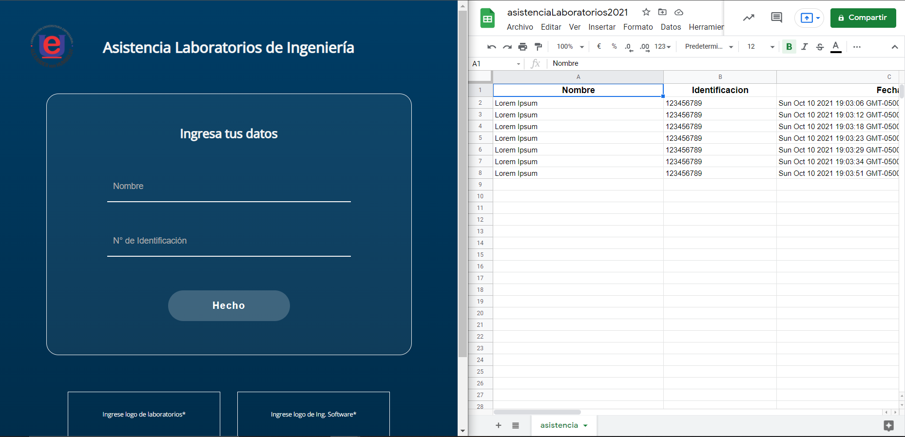

<h1>App-Asistencia-Labs-Ing</h1>
<h3>Desarrollo para los laboratorios de la Facultad de Ingenierías de la CUE AvH.</h3>

Se busca automatizar la toma de asistencia de los estudiantes y docentes que usan los espacios del laboratorio por medio de una aplicacion web que permita guardar estos registros en una hoja de calculo de Google Sheets.

